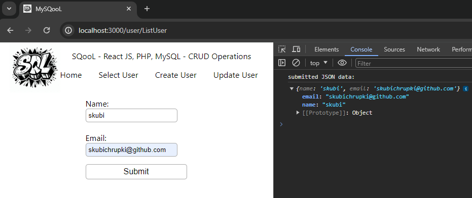

# SQooL
SQooL is a project aimed at exploring and comparing the integration of two popular SQL database management systems, Microsoft SQL Server and MySQL, within web applications. 

## Technologies Used:

- MySQooL:
  - Frontend: React.js
  - Backend: PHP
  - Database: MySQL
- SQooL Server tbd

## Lore:
SQooL is a project born out of the recognition that transitioning from Excel spreadsheets to SQL databases offers significant advantages for companies in terms of data management, analysis, and collaboration. As data volumes grow and business requirements evolve, Excel's shortcomings become increasingly apparent. Issues such as version control, data integrity, limited collaboration capabilities, and performance bottlenecks hinder productivity and decision-making. 
 
Project presents a compelling argument for the adoption of web applications with SQL databases as a viable replacement for Excel in company workflows. By embracing this paradigm shift and considering factors such as advanced querying capabilities, enhanced security, scalability, and pricing, companies can overcome the limitations of Excel, unlock the full potential of their data, and drive innovation and growth in the digital age.

## Comparison Microsoft SQL Server vs MySQL: tbd

- Features:
- Performance:
- Scalability:
- Pricing:

## Conclusion: tbd

